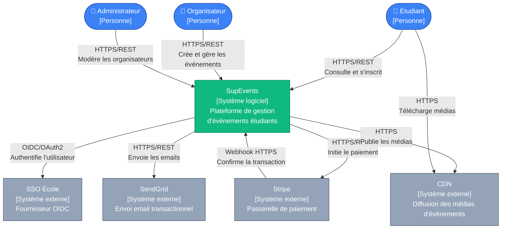
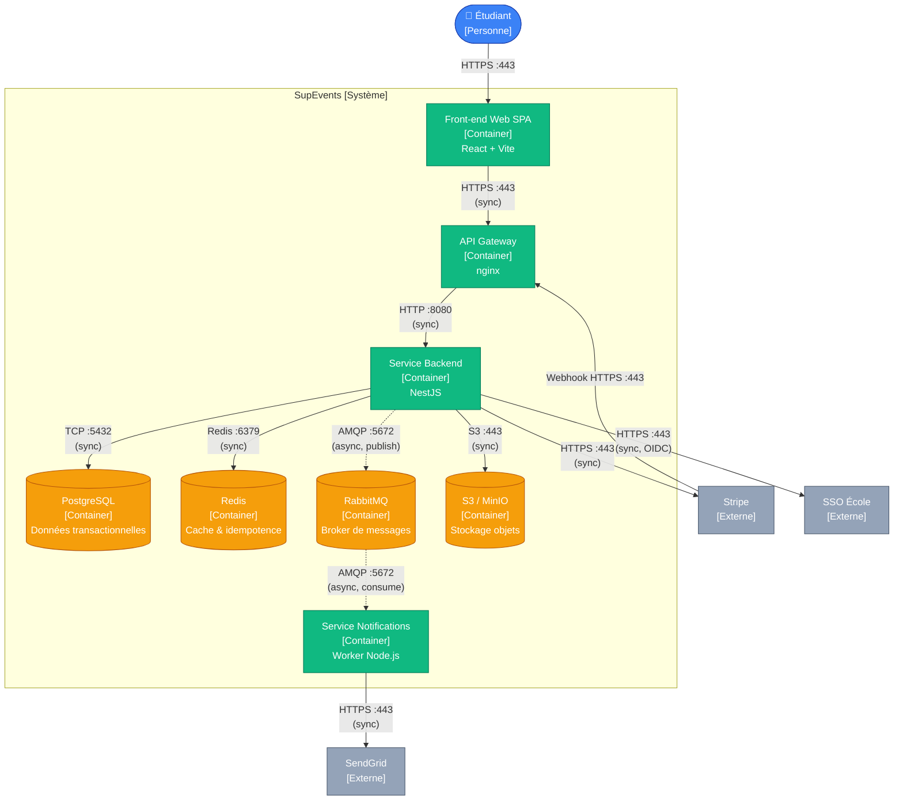
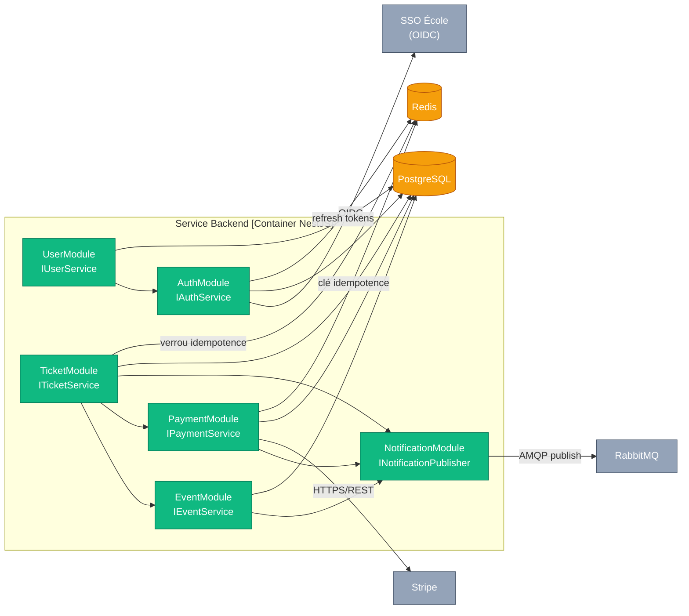

# §6.1 — Vue logique

Cette section présente trois diagrammes structurels : le **contexte C4** (vue grand angle), les **containers C4** (briques déployables), et les **composants** internes du service backend. Chaque diagramme cible une audience différente — direction métier, équipe technique, développeurs backend — et zoome progressivement à l'intérieur du système.

---

## §6.1.1 — Diagramme C4 Context

Ce diagramme situe SupEvents dans son écosystème : qui l'utilise et avec quels systèmes externes il interagit. Il est destiné à tout lecteur, y compris non technique, pour comprendre le périmètre d'intégration. Aucune information de découpage interne n'y figure.

**Lecture du diagramme.** SupEvents joue le rôle de point central d'orchestration sans assumer ni l'identité (déléguée au SSO école) ni le transport des emails (délégué à SendGrid) ni le traitement bancaire (délégué à Stripe). Cette stratégie de délégation systématique aux tiers spécialisés est documentée dans l'ADR-003 et concentre la valeur SupEvents sur le métier d'inscription et de gestion d'événements. Le CDN externe sert les médias d'événements (visuels, photos d'affiches) directement aux étudiants pour décharger le backend des transferts statiques.

---

## §6.1.2 — Diagramme C4 Containers

Ce diagramme zoome à l'intérieur de SupEvents et montre les blocs déployables, leurs technologies et les protocoles entre eux. Il est destiné aux équipes de développement, d'architecture et d'exploitation pour comprendre la structure macro avant tout choix d'implémentation.

**Lecture du diagramme.** Les flèches pleines représentent les appels synchrones, les pointillées les flux asynchrones via RabbitMQ (notifications, génération de billets, rappels). Le Service Backend NestJS concentre la logique métier ; le Worker Notifications est isolé pour absorber les pics d'envoi email sans dégrader la latence des requêtes utilisateur. Le choix de RabbitMQ plutôt que Kafka ou Redis Streams est tracé dans l'ADR-001. Le découpage front/back/worker permet une scalabilité horizontale indépendante des composants critiques (ENF-08).

---

## §6.1.3 — Diagramme de composants — Container Backend

Ce diagramme décompose l'intérieur du Service Backend NestJS en six modules fonctionnels. Il est destiné aux développeurs backend pour identifier les frontières et les dépendances réelles entre modules. Les détails internes (controllers, services, repositories) seront documentés en §7.

**Lecture du diagramme.** Les dépendances réelles sont minimales : `TicketModule` orchestre Event + Payment + Notification, mais ne dépend pas de tous les autres modules. `NotificationModule` n'a aucune dépendance entrante directe vers d'autres modules — il est uniquement appelé pour publier sur RabbitMQ (découplage par broker). Cette frontière est essentielle : changer le canal d'envoi (SendGrid → autre fournisseur) n'impacte que le Worker, pas les modules métier. Le point de couplage le plus critique se situe entre `TicketModule` et `PaymentModule` (atomicité réservation + paiement) et fait l'objet de l'ADR-002 (verrou pessimiste sur la jauge).
