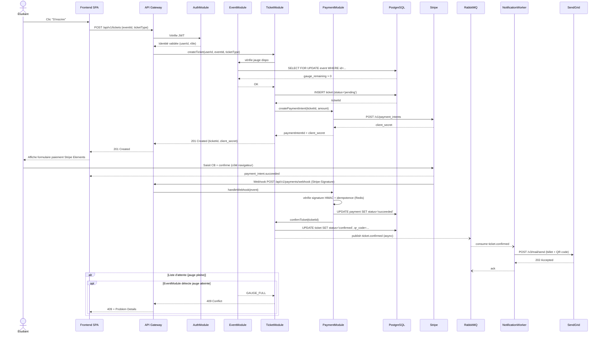
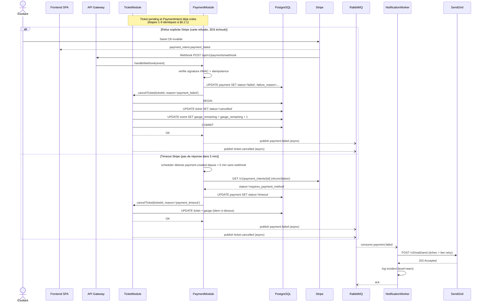

# §6.2 — Vue des processus

Cette section documente les comportements dynamiques de SupEvents pour deux scénarios critiques : l'inscription nominale à un événement payant et l'échec de paiement. Elle est destinée aux développeurs implémentant les modules `TicketModule`, `PaymentModule`, `NotificationModule` ainsi qu'aux testeurs vérifiant la résilience du parcours.

---

## §6.2.1 — Séquence : Inscription nominale à un événement payant

Ce diagramme couvre le parcours complet depuis le clic « S'inscrire » côté étudiant jusqu'à la réception du billet par email. Les cas de paiement échoué et de jauge pleine sont traités séparément en §6.2.2 et §7.2.

**Lecture du diagramme.** Le parcours nominal repose sur trois propriétés clés : (1) un **verrou pessimiste PostgreSQL** (`SELECT FOR UPDATE`) sur la ligne événement garantit l'atomicité de la décrémentation de jauge en cas d'inscriptions concurrentes — ADR-002 ; (2) la **confirmation finale du ticket est différée jusqu'au webhook Stripe**, évitant les tickets « confirmés mais non payés » ; (3) l'**envoi email est asynchrone via RabbitMQ**, ce qui isole le SLO de latence de l'API (p95 < 500 ms) de la disponibilité de SendGrid. Le fragment `alt` documente le rejet immédiat si la jauge est pleine, sans création de ticket pending.

---

## §6.2.2 — Séquence : Échec de paiement

Ce diagramme reprend le flux jusqu'à l'étape webhook Stripe, mais cette fois le paiement échoue (carte refusée) ou time-out (aucune réponse de Stripe dans les délais). La conséquence métier diffère : le ticket pending doit être libéré et l'étudiant notifié.

**Lecture du diagramme.** Le fragment `alt` distingue deux causes d'échec aux conséquences techniques identiques (libération de jauge, notification de l'étudiant) mais aux origines opposées : un refus explicite Stripe (webhook reçu) ou un timeout (aucune réponse, détecté par un scheduler de réconciliation côté SupEvents). La cohérence entre `payment.status`, `ticket.status` et `event.gauge_remaining` est garantie par une transaction PostgreSQL unique. La notification d'échec, comme la notification de succès, transite par RabbitMQ pour éviter qu'un incident SendGrid bloque la libération de la jauge. La stratégie de réconciliation périodique des paiements orphelins est documentée en détail dans la fiche `PaymentModule` (§7.2) et tracée à l'ADR-002.
