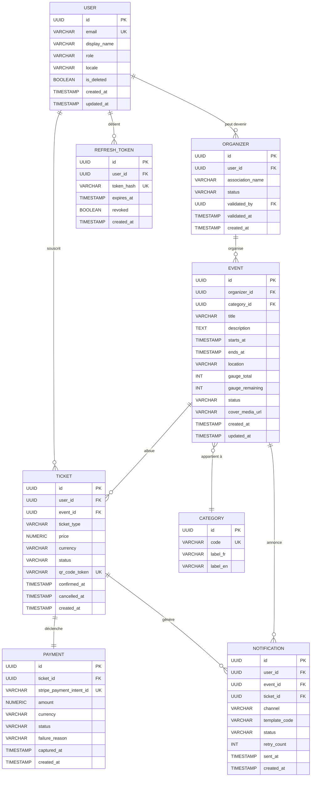

# §6.4 — Vue des données

## Modèle entité-relation

Le modèle ci-dessous représente les huit entités persistées par SupEvents. Les relations portent toutes une cardinalité explicite et un libellé métier. Les attributs structurants de chaque entité sont listés ; le dictionnaire de données ci-après détaille les types, contraintes et la sensibilité RGPD.

**Lecture du diagramme.** Les deux entités centrales sont `USER` et `EVENT`. Leur relation n'est pas directe : tout étudiant inscrit à un événement passe par un `TICKET` qui est une entité de plein droit (ticket_type, prix, QR code, statut). `PAYMENT` est strictement 1:1 avec `TICKET` (un ticket = au plus un paiement). `ORGANIZER` est une projection de `USER` : un utilisateur ayant validé son statut d'organisateur. `REFRESH_TOKEN` est isolé pour permettre une révocation fine sans toucher au compte. Seul l'identifiant Stripe est stocké (`stripe_payment_intent_id`), aucune donnée bancaire ne réside chez nous (PCI-DSS délégué).

---

## Dictionnaire de données

### Entité `User`

| Champ | Type | Contraintes | Description | Sensibilité RGPD |
|---|---|---|---|---|
| `id` | UUID | PK, NOT NULL | Identifiant pivot interne | Non |
| `email` | VARCHAR(255) | UK, NOT NULL | Email de l'utilisateur (identifiant SSO école) | Oui |
| `display_name` | VARCHAR(120) | NOT NULL | Nom affiché (prénom + nom) | Oui |
| `role` | VARCHAR(20) | NOT NULL, CHECK IN ('student','organizer','admin'), DEFAULT 'student' | Rôle RBAC | Non |
| `locale` | VARCHAR(5) | NOT NULL, DEFAULT 'fr-FR' | Langue préférée (FR/EN) | Non |
| `is_deleted` | BOOLEAN | NOT NULL, DEFAULT FALSE | Marqueur de droit à l'oubli (anonymisation différée) | Non |
| `created_at` | TIMESTAMP | NOT NULL, DEFAULT NOW() | Date de création | Non |
| `updated_at` | TIMESTAMP | NOT NULL | Date de dernière modification | Non |

**Stratégie de protection RGPD** : `email` et `display_name` sont chiffrés au repos via le chiffrement disque de l'instance gérée (AWS RDS encryption ou GCP Cloud SQL encryption, clé gérée par le fournisseur, rotation annuelle automatique). Lors de l'exercice du droit à l'oubli, `email` est remplacé par un hash SHA-256 + sel, `display_name` par une chaîne fixe (`"Utilisateur supprimé"`) et `is_deleted` passe à `TRUE`. Les tickets historiques sont conservés sans lien identifiant nominatif (cf. ADR pseudonymisation, candidat futur).

### Entité `Organizer`

| Champ | Type | Contraintes | Description | Sensibilité RGPD |
|---|---|---|---|---|
| `id` | UUID | PK, NOT NULL | Identifiant interne | Non |
| `user_id` | UUID | FK → User.id, UNIQUE, NOT NULL | Utilisateur projeté | Non |
| `association_name` | VARCHAR(150) | NOT NULL | Nom de l'association ou entité organisatrice | Non |
| `status` | VARCHAR(20) | NOT NULL, CHECK IN ('pending','approved','revoked'), DEFAULT 'pending' | Statut de validation | Non |
| `validated_by` | UUID | FK → User.id, NULL | Admin ayant validé | Non |
| `validated_at` | TIMESTAMP | NULL | Date de validation | Non |
| `created_at` | TIMESTAMP | NOT NULL, DEFAULT NOW() | Date de demande | Non |

### Entité `Event`

| Champ | Type | Contraintes | Description | Sensibilité RGPD |
|---|---|---|---|---|
| `id` | UUID | PK, NOT NULL | Identifiant interne | Non |
| `organizer_id` | UUID | FK → Organizer.id, NOT NULL | Organisateur propriétaire | Non |
| `category_id` | UUID | FK → Category.id, NOT NULL | Catégorie | Non |
| `title` | VARCHAR(200) | NOT NULL | Titre affiché | Non |
| `description` | TEXT | NOT NULL | Description longue | Non |
| `starts_at` | TIMESTAMP | NOT NULL | Date/heure de début | Non |
| `ends_at` | TIMESTAMP | NOT NULL, CHECK (ends_at > starts_at) | Date/heure de fin | Non |
| `location` | VARCHAR(255) | NOT NULL | Lieu physique | Non |
| `gauge_total` | INT | NOT NULL, CHECK (gauge_total > 0) | Capacité maximale | Non |
| `gauge_remaining` | INT | NOT NULL, CHECK (gauge_remaining >= 0 AND gauge_remaining <= gauge_total) | Places restantes | Non |
| `status` | VARCHAR(20) | NOT NULL, CHECK IN ('draft','published','cancelled','archived'), DEFAULT 'draft' | Cycle de vie | Non |
| `cover_media_url` | VARCHAR(500) | NULL | URL S3 du visuel | Non |
| `created_at` | TIMESTAMP | NOT NULL, DEFAULT NOW() | Date de création | Non |
| `updated_at` | TIMESTAMP | NOT NULL | Date de dernière modification | Non |

### Entité `Category`

| Champ | Type | Contraintes | Description | Sensibilité RGPD |
|---|---|---|---|---|
| `id` | UUID | PK, NOT NULL | Identifiant interne | Non |
| `code` | VARCHAR(50) | UK, NOT NULL | Code stable (ex: `conference`, `party`) | Non |
| `label_fr` | VARCHAR(100) | NOT NULL | Libellé français | Non |
| `label_en` | VARCHAR(100) | NOT NULL | Libellé anglais | Non |

### Entité `Ticket`

| Champ | Type | Contraintes | Description | Sensibilité RGPD |
|---|---|---|---|---|
| `id` | UUID | PK, NOT NULL | Identifiant interne | Non |
| `user_id` | UUID | FK → User.id, NOT NULL | Étudiant inscrit | Non |
| `event_id` | UUID | FK → Event.id, NOT NULL | Événement | Non |
| `ticket_type` | VARCHAR(20) | NOT NULL, CHECK IN ('free','standard','early_bird') | Type de billet | Non |
| `price` | NUMERIC(10,2) | NOT NULL, CHECK (price >= 0) | Prix payé | Non |
| `currency` | VARCHAR(3) | NOT NULL, DEFAULT 'EUR' | Devise ISO 4217 | Non |
| `status` | VARCHAR(20) | NOT NULL, CHECK IN ('pending','confirmed','cancelled','used'), DEFAULT 'pending' | Cycle de vie du ticket | Non |
| `qr_code_token` | VARCHAR(64) | UK, NULL | Jeton signé HMAC encodé dans le QR | Non |
| `confirmed_at` | TIMESTAMP | NULL | Date de confirmation | Non |
| `cancelled_at` | TIMESTAMP | NULL | Date d'annulation | Non |
| `created_at` | TIMESTAMP | NOT NULL, DEFAULT NOW() | Date de création | Non |

**Contrainte d'unicité métier** : `UNIQUE (user_id, event_id) WHERE status IN ('pending','confirmed')` — empêche les doubles inscriptions actives pour un même couple utilisateur / événement.

### Entité `Payment`

| Champ | Type | Contraintes | Description | Sensibilité RGPD |
|---|---|---|---|---|
| `id` | UUID | PK, NOT NULL | Identifiant interne | Non |
| `ticket_id` | UUID | FK → Ticket.id, UNIQUE, NOT NULL | Ticket associé (1:1) | Non |
| `stripe_payment_intent_id` | VARCHAR(255) | UK, NOT NULL | Référence Stripe — seule donnée externalisée vers nous | Non |
| `amount` | NUMERIC(10,2) | NOT NULL, CHECK (amount >= 0) | Montant en devise | Non |
| `currency` | VARCHAR(3) | NOT NULL, DEFAULT 'EUR' | Devise ISO 4217 | Non |
| `status` | VARCHAR(20) | NOT NULL, CHECK IN ('created','succeeded','failed','timeout','refunded') | Statut Stripe miroir | Non |
| `failure_reason` | VARCHAR(255) | NULL | Code d'erreur Stripe en cas d'échec | Non |
| `captured_at` | TIMESTAMP | NULL | Date de capture effective | Non |
| `created_at` | TIMESTAMP | NOT NULL, DEFAULT NOW() | Date de création de l'intent | Non |

**Rappel CDC** : aucun numéro de carte, CVC ou IBAN ne figure ici. La conformité PCI-DSS est entièrement délégée à Stripe (cf. §9).

### Entité `Notification`

| Champ | Type | Contraintes | Description | Sensibilité RGPD |
|---|---|---|---|---|
| `id` | UUID | PK, NOT NULL | Identifiant interne | Non |
| `user_id` | UUID | FK → User.id, NOT NULL | Destinataire | Non |
| `event_id` | UUID | FK → Event.id, NULL | Événement concerné si applicable | Non |
| `ticket_id` | UUID | FK → Ticket.id, NULL | Ticket concerné si applicable | Non |
| `channel` | VARCHAR(20) | NOT NULL, CHECK IN ('email','in_app') | Canal de diffusion | Non |
| `template_code` | VARCHAR(50) | NOT NULL | Code de template SendGrid ou interne | Non |
| `status` | VARCHAR(20) | NOT NULL, CHECK IN ('queued','sent','failed','dead_letter') | Statut d'envoi | Non |
| `retry_count` | INT | NOT NULL, DEFAULT 0 | Compteur de tentatives | Non |
| `sent_at` | TIMESTAMP | NULL | Date d'envoi effectif | Non |
| `created_at` | TIMESTAMP | NOT NULL, DEFAULT NOW() | Date d'émission | Non |

### Entité `RefreshToken`

| Champ | Type | Contraintes | Description | Sensibilité RGPD |
|---|---|---|---|---|
| `id` | UUID | PK, NOT NULL | Identifiant interne | Non |
| `user_id` | UUID | FK → User.id, NOT NULL | Propriétaire | Non |
| `token_hash` | VARCHAR(64) | UK, NOT NULL | SHA-256 du token | Oui |
| `expires_at` | TIMESTAMP | NOT NULL | Expiration | Non |
| `revoked` | BOOLEAN | NOT NULL, DEFAULT FALSE | Marqueur de révocation explicite | Non |
| `created_at` | TIMESTAMP | NOT NULL, DEFAULT NOW() | Date de création | Non |

**Stratégie de protection** : le token en clair n'est jamais stocké. Seul son SHA-256 est persisté. À la révocation, `revoked` passe à `TRUE` et la ligne est supprimée 30 jours plus tard par un job de purge.

---

## Stratégie de stockage

| Famille | Système | Utilisation chez SupEvents |
|---|---|---|
| Relationnel | **PostgreSQL** | Entités `User`, `Organizer`, `Event`, `Category`, `Ticket`, `Payment`, `Notification`, `RefreshToken`. Justification : l'atomicité de la séquence décrément-de-jauge + création-ticket + capture-paiement exige des transactions ACID et un verrou pessimiste `SELECT FOR UPDATE` sur la ligne `Event` (cf. ADR-002). Les contraintes d'unicité composite (un seul ticket actif par couple user/event) sont également natives. |
| Cache clé-valeur | **Redis** | Trois usages distincts : (1) clés d'idempotence des webhooks Stripe (TTL 24 h) pour éviter les replays — cf. ADR-003 ; (2) stockage des `RefreshToken` hashés pour révocation rapide (durée de vie = expiration JWT) ; (3) rate limiting (sliding window) sur les endpoints publics (`/api/v1/events`). |
| Objet | **S3 / MinIO** | Visuels d'événements (`cover_media_url`), exports CSV générés à la demande. Convention de nommage : `events/{eventId}/cover-{uuid}.{ext}` pour les visuels, `exports/{organizerId}/{eventId}-{yyyymmdd}.csv` pour les exports. Accès via URL pré-signées (cf. ADR candidat URL signées). |
| Messagerie | **RabbitMQ** | Bus d'événements asynchrones — exchange `supevents.events.v1` (topic). Quatre événements documentés en §8 : `ticket.confirmed`, `ticket.cancelled`, `payment.failed`, `event.cancelled`. Découple le parcours d'inscription synchrone (latence p95 < 500 ms) de l'envoi email (SendGrid, latence variable). Choix RabbitMQ vs Kafka tracé dans l'ADR-001. |

## Données sensibles RGPD

Les champs marqués `Oui` dans le dictionnaire (`email`, `display_name`, `token_hash`) font l'objet de trois mesures transversales documentées en détail dans la section §9 :

1. **Chiffrement au repos** via le chiffrement disque de l'instance gérée (RDS encryption / Cloud SQL encryption) et **en transit** (TLS 1.2+).
2. **Droit à l'oubli** : anonymisation déclenchée par l'API `DELETE /api/v1/users/me`, exécutée sous 30 jours, garde l'intégrité référentielle des historiques d'événements.
3. **Durée de rétention** : 36 mois après dernière activité, puis anonymisation automatique.

Le marquage explicite ici alimente directement la matrice de traçabilité §10 (exigence `ENF-03` — conformité RGPD).
