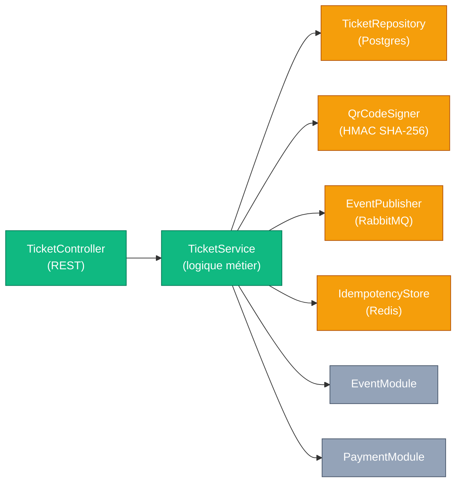
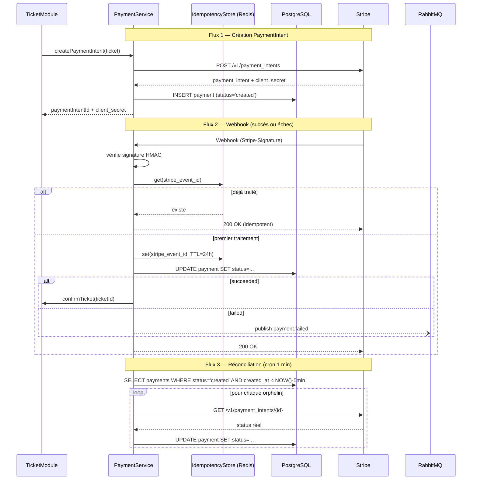
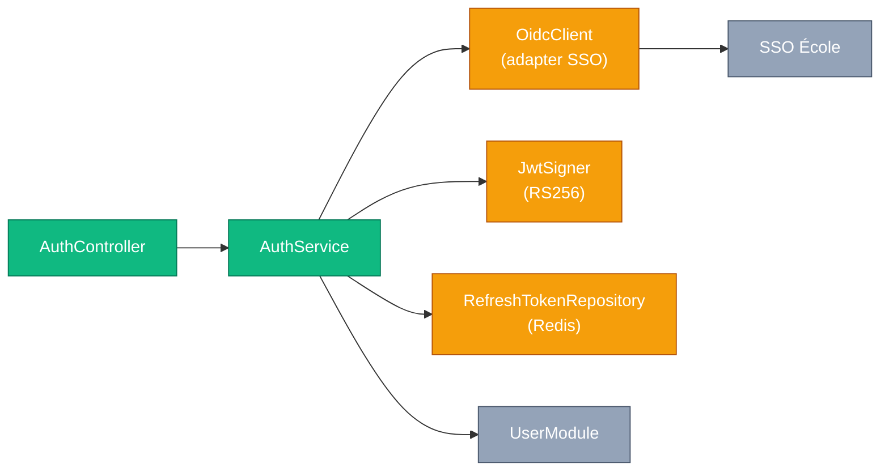

# §7 — Conception détaillée par module

Cette section décrit en détail trois modules choisis pour leur diversité technique : un module orchestrateur de paiement (`PaymentModule`), un module métier complexe avec cycle de vie (`TicketModule`) et un module transverse d'authentification (`AuthModule`). Chaque fiche suit la structure invariante en six rubriques.

---

## §7.1 — TicketModule

### Responsabilité unique

Le `TicketModule` orchestre le cycle de vie complet d'un billet, depuis sa création en statut `pending` jusqu'à sa confirmation ou son annulation, en garantissant l'atomicité de l'allocation sur la jauge limitée de l'événement.

### Contrat d'interface

| Type | Élément | Détail |
|---|---|---|
| Endpoints REST exposés | `POST /api/v1/tickets` | 201 / 400 / 403 / 404 / 409 / 422 |
| | `GET /api/v1/tickets/{id}` | 200 / 403 / 404 |
| | `GET /api/v1/tickets/me` | 200 |
| | `POST /api/v1/tickets/{id}/cancel` | 200 / 403 / 404 / 409 |
| Événements publiés (RabbitMQ) | `ticket.confirmed` | Topic `supevents.events.v1` |
| | `ticket.cancelled` | Topic `supevents.events.v1` (publié pour toute annulation : utilisateur, échec paiement, cascade depuis `event.cancelled`) |
| Événements consommés (RabbitMQ) | `event.cancelled` | Annule en cascade tous les tickets `pending` ou `confirmed` de l'événement et publie un `ticket.cancelled` par ticket impacté |
| Appels sortants | `PaymentModule.createPaymentIntent()` | Interne (synchrone) |
| | `EventModule.lockAndDecrement()` | Interne (synchrone, transaction) |

### Architecture interne



**Lecture du diagramme.** Découpage hexagonal classique : le contrôleur REST est isolé du service métier, et tous les accès externes (Postgres, Redis, RabbitMQ, modules pairs) passent par des adaptateurs explicites. Cette frontière permet de tester le service avec des doubles sans toucher au broker.

### Algorithme critique : création atomique d'un ticket

```text
fonction createTicket(userId, eventId, ticketType, idempotencyKey):
    # 1. Idempotence côté client
    si idem.get(idempotencyKey) existe:
        retourner idem.get(idempotencyKey)
    # 2. Vérification doublon métier
    si TicketRepository.existsActiveByUserAndEvent(userId, eventId):
        lever DUPLICATE_INSCRIPTION (409)
    # 3. Transaction atomique Postgres
    DEBUT TRANSACTION
        event = EventRepository.selectForUpdate(eventId)  # verrou pessimiste
        si event.status != 'published':
            lever EVENT_NOT_AVAILABLE (409)
        si event.gauge_remaining <= 0:
            lever GAUGE_FULL (409)
        event.gauge_remaining -= 1
        EventRepository.save(event)
        ticket = nouveau Ticket(
            user_id=userId,
            event_id=eventId,
            ticket_type=ticketType,
            price=resolvePrice(event, ticketType),
            status='pending'
        )
        TicketRepository.save(ticket)
        si ticket.price > 0:
            payment = PaymentModule.createPaymentIntent(ticket)
        sinon:
            ticket.status = 'confirmed'
            ticket.qr_code_token = QrCodeSigner.sign(ticket.id)
            ticket.confirmed_at = NOW()
            TicketRepository.save(ticket)
    COMMIT
    # 4. Publication événement (hors transaction, outbox simplifié)
    si ticket.status == 'confirmed':
        EventPublisher.publish('ticket.confirmed', payload)
    # 5. Enregistrement idempotence
    idem.set(idempotencyKey, response, TTL=24h)
    retourner response
```

Décisions documentées par cet algorithme : verrou pessimiste sur la ligne `Event` plutôt qu'optimiste avec retry (cf. **ADR-002**) ; idempotence par clé client `Idempotency-Key` (cf. **ADR-003**) ; confirmation différée pour les tickets payants jusqu'au webhook Stripe.

### Gestion des erreurs

| Code interne | Cause | Comportement | Code HTTP |
|---|---|---|---|
| `DUPLICATE_INSCRIPTION` | Ticket actif déjà existant pour ce couple user/event | Pas de création, réponse explicite | 409 |
| `GAUGE_FULL` | `event.gauge_remaining == 0` | Pas de création, message localisé | 409 |
| `EVENT_NOT_AVAILABLE` | Événement en statut `draft`, `cancelled` ou `archived` | Pas de création | 409 |
| `PAYMENT_PROVIDER_DOWN` | Stripe injoignable lors de `createPaymentIntent` | Rollback transaction, réponse temporaire | 503 |
| `IDEMPOTENCY_KEY_REPLAY_MISMATCH` | Même `Idempotency-Key` avec un corps différent | Refus | 422 |
| `INVALID_TICKET_TYPE` | `early_bird` demandé mais limite atteinte ou expirée | Refus | 422 |

### Cas limites identifiés

**Cas limite : double-clic sur "S'inscrire"**
Description du scénario. L'utilisateur clique deux fois rapidement, deux requêtes `POST /tickets` partent avec la même `Idempotency-Key`.

Décision retenue : la deuxième requête retourne la même réponse que la première (lookup Redis) sans créer de second ticket. Si la clé est manquante, le contrôle d'unicité métier `(user_id, event_id)` rejette la seconde requête en 409.
**Cas limite : dernière place disponible, deux inscriptions simultanées**
Description du scénario. Deux étudiants A et B cliquent à la milliseconde près sur le dernier siège.

Décision retenue : le `SELECT FOR UPDATE` sérialise les deux transactions Postgres. La première obtient la place, la seconde voit `gauge_remaining == 0` après libération du verrou et reçoit `GAUGE_FULL` (409). Aucune surréservation possible.
**Cas limite : annulation après paiement capturé**
Description du scénario. L'étudiant clique sur "Annuler ma participation" 24 h après confirmation.

Décision retenue : le ticket passe en `cancelled`, la jauge est ré-incrémentée, `PaymentModule.refund()` est invoqué pour rembourser intégralement via Stripe. Un événement `ticket.cancelled` est publié pour notifier l'étudiant.

### Décisions structurantes

- Voir **ADR-001** — Choix de RabbitMQ comme broker de messages (impacte les événements publiés)
- Voir **ADR-002** — Verrou pessimiste sur la jauge plutôt que verrou optimiste
- Voir **ADR-003** — Idempotence par clé client transmise dans l'en-tête `Idempotency-Key`

---

## §7.2 — PaymentModule

### Responsabilité unique

Le `PaymentModule` orchestre l'ensemble du cycle Stripe : création du `PaymentIntent`, réception du webhook signé, mise à jour transactionnelle du statut, et réconciliation périodique des paiements orphelins.

### Contrat d'interface

| Type | Élément | Détail |
|---|---|---|
| Endpoints REST exposés | `POST /api/v1/payments/webhook` | 200 / 400 / 401 (signature HMAC) |
| Événements publiés (RabbitMQ) | `payment.failed` | Topic `supevents.events.v1` |
| Événements consommés (RabbitMQ) | — (aucun, module purement orchestrateur) | |
| Appels sortants | `Stripe.PaymentIntents.create()` | HTTPS REST |
| | `Stripe.PaymentIntents.retrieve()` | HTTPS REST (réconciliation) |
| | `Stripe.Refunds.create()` | HTTPS REST |
| Interfaces internes exposées | `createPaymentIntent(ticket)` | Appelée par `TicketModule` |
| | `refund(ticketId)` | Appelée par `TicketModule` sur annulation |

### Architecture interne



**Lecture du diagramme.** Trois flux distincts cohabitent. Le flux 1 (synchrone, appelé par `TicketModule`) crée l'intent côté Stripe. Le flux 2 (webhook entrant) est le chemin nominal de confirmation/échec. Le flux 3 (cron) est le filet de sécurité contre les webhooks perdus — Stripe peut ne jamais nous notifier si notre webhook est en panne ; la réconciliation périodique évite les paiements bloqués à `created`.

### Algorithme critique : réception du webhook Stripe

```text
fonction handleWebhook(rawBody, signatureHeader):
    # 1. Vérification de signature
    si !Stripe.verifySignature(rawBody, signatureHeader, WEBHOOK_SECRET):
        lever WEBHOOK_SIGNATURE_INVALID (401)
    event = parseJson(rawBody)
    # 2. Idempotence
    si IdempotencyStore.exists(event.id):
        retourner 200  # replay déjà traité
    # 3. Distribution selon le type
    selon event.type:
        cas 'payment_intent.succeeded':
            DEBUT TRANSACTION
                payment = PaymentRepository.findByStripeId(event.data.id)
                payment.status = 'succeeded'
                payment.captured_at = NOW()
                PaymentRepository.save(payment)
                TicketModule.confirmTicket(payment.ticket_id)
            COMMIT
        cas 'payment_intent.payment_failed':
            DEBUT TRANSACTION
                payment = PaymentRepository.findByStripeId(event.data.id)
                payment.status = 'failed'
                payment.failure_reason = mapStripeFailureCode(event)
                PaymentRepository.save(payment)
                TicketModule.cancelTicket(payment.ticket_id)
            COMMIT
            EventPublisher.publish('payment.failed', payload)
        défaut:
            log info "Event type ignoré"
    # 4. Marquage idempotence
    IdempotencyStore.set(event.id, processed_at=NOW(), TTL=24h)
    retourner 200
```

### Gestion des erreurs

| Code interne | Cause | Comportement | Code HTTP |
|---|---|---|---|
| `WEBHOOK_SIGNATURE_INVALID` | En-tête `Stripe-Signature` manquant ou invalide | Rejet immédiat, log d'alerte sécurité | 401 |
| `WEBHOOK_REPLAY` | `event.id` déjà présent dans Redis | Réponse 200 sans traitement (idempotence) | 200 |
| `STRIPE_PROVIDER_DOWN` | Échec de `createPaymentIntent` (timeout) | Rollback transaction Ticket, réponse temporaire au client | 503 |
| `PAYMENT_ORPHAN_DETECTED` | Cron détecte un paiement `created` > 5 min sans webhook | Réconciliation via `GET /payment_intents/{id}`, log + alerte si > 10 occurrences/h | — |
| `REFUND_ALREADY_PROCESSED` | Tentative de remboursement d'un paiement déjà remboursé | Réponse 200 idempotente | 200 |

### Cas limites identifiés

**Cas limite : webhook Stripe reçu deux fois (replay)**
Description du scénario. Stripe re-déclenche le webhook après une réponse 5xx ou un timeout réseau côté SupEvents.

Décision retenue : idempotence stricte par `event.id` Stripe, stockée dans Redis avec un TTL de 24 h. Le second appel répond 200 sans rejouer la transaction métier.
**Cas limite : paiement capturé mais aucun ticket associé en base**
Description du scénario. Le `PaymentIntent` est créé et confirmé côté Stripe, mais le serveur SupEvents crash avant l'`INSERT payment` en base.

Décision retenue : le cron de réconciliation toutes les minutes interroge Stripe pour les paiements `created` depuis plus de 5 min. Si Stripe répond `succeeded` sans contrepartie locale, une alerte ops est levée et un remboursement automatique est déclenché (paiement orphelin, pas de ticket).

### Décisions structurantes

- Voir **ADR-001** — Choix de RabbitMQ comme broker pour la publication `payment.failed`
- Voir **ADR-003** — Idempotence par `event.id` Stripe (déduplication serveur) plutôt que par clé client

---

## §7.3 — AuthModule

### Responsabilité unique

L'`AuthModule` gère l'authentification OIDC via le SSO école, le provisioning automatique des nouveaux utilisateurs, l'émission de JWT applicatifs courte durée et la rotation des refresh tokens.

### Contrat d'interface

| Type | Élément | Détail |
|---|---|---|
| Endpoints REST exposés | `GET /api/v1/auth/login` | 302 |
| | `GET /api/v1/auth/callback` | 200 / 302 / 400 / 401 |
| | `POST /api/v1/auth/refresh` | 200 / 401 / 403 |
| | `POST /api/v1/auth/logout` | 204 |
| Événements publiés (RabbitMQ) | `user.provisioned` (futur) | Topic `supevents.events.v1` — non implémenté en v1 |
| Événements consommés (RabbitMQ) | — | |
| Appels sortants | `SSO École /authorize` | HTTPS (redirect) |
| | `SSO École /token` | HTTPS POST (échange code) |
| | `SSO École /userinfo` | HTTPS GET |
| Interfaces internes exposées | `verifyAccessToken(jwt)` | Middleware appelé par `API Gateway` |

### Architecture interne



**Lecture du diagramme.** Le `JwtSigner` utilise une paire de clés RS256 — clé privée pour signer côté backend, clé publique exposée via `/.well-known/jwks.json` pour permettre à des services tiers (futur) de valider les tokens sans appeler SupEvents. Les refresh tokens sont stockés hashés dans Redis avec un TTL aligné sur leur expiration (30 jours). Aucun token en clair n'est persisté.

### Algorithme critique : callback OIDC

```text
fonction callback(code, state):
    # 1. Validation du state (anti-CSRF)
    si !StateStore.consume(state):  # state était dans un cookie HttpOnly
        lever STATE_INVALID (400)
    # 2. Échange code -> tokens auprès du SSO
    ssoTokens = SsoClient.exchangeCode(code, redirect_uri)
    ssoIdToken = ssoTokens.id_token
    # 3. Validation du id_token SSO
    claims = JwtValidator.verify(ssoIdToken, SSO_JWKS)
    si claims.iss != SSO_ISSUER ou claims.aud != CLIENT_ID:
        lever ID_TOKEN_INVALID (401)
    # 4. Provisioning ou récupération de l'utilisateur
    user = UserModule.findByEmail(claims.email)
    si user est null:
        user = UserModule.provision(
            email=claims.email,
            display_name=claims.name,
            role='student',
            locale=claims.locale || 'fr-FR'
        )
    # 5. Émission des tokens applicatifs
    accessToken = JwtSigner.sign({
        sub: user.id,
        role: user.role,
        iss: 'supevents',
        exp: NOW() + 15min
    })
    refreshToken = generateRandom(256bits)
    RefreshTokenRepository.save(
        user_id=user.id,
        token_hash=sha256(refreshToken),
        expires_at=NOW() + 30days
    )
    # 6. Réponse au navigateur
    setCookieHttpOnlySecure('refresh_token', refreshToken)
    retourner accessToken
```

### Gestion des erreurs

| Code interne | Cause | Comportement | Code HTTP |
|---|---|---|---|
| `STATE_INVALID` | `state` du callback ne correspond pas à celui émis | Rejet, log d'alerte sécurité (potentielle CSRF) | 400 |
| `ID_TOKEN_INVALID` | Signature `id_token` invalide ou claims incohérents | Rejet immédiat | 401 |
| `SSO_PROVIDER_DOWN` | SSO école injoignable lors de l'échange code | Réponse temporaire, retry suggéré | 503 |
| `REFRESH_TOKEN_REVOKED` | Le refresh token a été révoqué côté SupEvents | Rejet, oblige re-login | 401 |
| `REFRESH_TOKEN_EXPIRED` | TTL Redis expiré | Rejet, oblige re-login | 401 |

### Cas limites identifiés

**Cas limite : token JWT révoqué côté SSO mais encore valide localement**
Description du scénario. Un administrateur école désactive un compte étudiant côté SSO. L'access token applicatif (TTL 15 min) reste valide jusqu'à expiration.

Décision retenue : la durée de vie courte de l'access token (15 min) limite la fenêtre d'exposition. Lors du `POST /auth/refresh`, l'`AuthModule` interroge à nouveau `/userinfo` du SSO et révoque immédiatement le refresh token si la réponse indique compte désactivé. Cette stratégie est un compromis acceptable documenté ; une introspection à chaque requête serait trop coûteuse en latence.
**Cas limite : premier login d'un utilisateur inconnu**
Description du scénario. Un étudiant se connecte pour la première fois via le SSO école. Aucune ligne `User` n'existe en base.

Décision retenue : provisioning automatique transparent dans le callback OIDC. La ligne `User` est créée avec rôle `student` par défaut, locale extraite des claims SSO ou `fr-FR` par défaut. Aucun écran de bienvenue intermédiaire, l'expérience est fluide.

### Décisions structurantes

- Délégation totale de l'identité au SSO école (pas de mot de passe local)
- JWT applicatifs en RS256 + JWKS exposé pour future intégration tierce
- Refresh tokens hashés en Redis (jamais en clair, jamais en Postgres)
