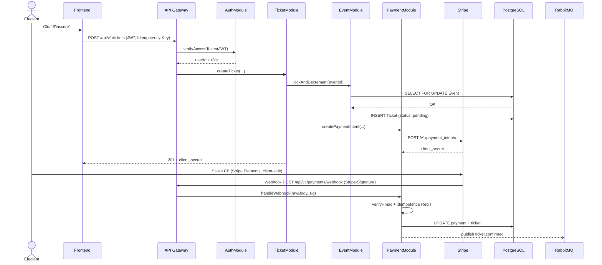
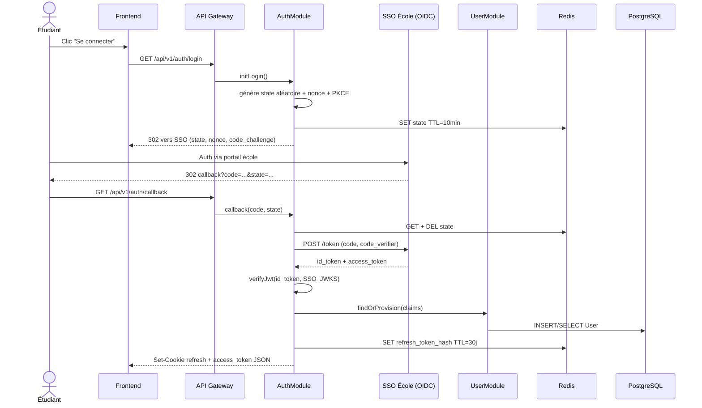

# §9 — Exigences transverses

Cette section couvre les contraintes pesant sur l'ensemble du système SupEvents : sécurité (analyse STRIDE de deux flux critiques), performance et disponibilité (SLO chiffrés + budget d'erreur), conformité RGPD (registre des traitements, mécanismes transversaux, procédures liées aux droits des personnes). Les exigences ici énoncées sont tracées vers les modules et sections concernées dans la matrice §10.

---

## §9.1 — Sécurité (analyse STRIDE)

L'analyse STRIDE est appliquée flux par flux, pas globalement. Deux flux critiques sont retenus pour SupEvents : l'inscription payante (cœur du système, manipule paiement et identité) et l'authentification SSO (point d'entrée de toute session). Le flux de réception webhook Stripe, également critique, est partiellement couvert dans la fiche `PaymentModule` (§7.2) et fera l'objet d'une fiche STRIDE dédiée au TP 1.8.

### §9.1.1 — Flux : Inscription payante

Le flux combine trois acteurs (étudiant, SupEvents, Stripe) et trois canaux d'attaque potentiels : la requête sortante navigateur → API, la saisie de carte navigateur → Stripe Elements, et le webhook entrant Stripe → SupEvents. Les données les plus sensibles transitent **uniquement entre le navigateur et Stripe** : le numéro de carte ne touche jamais nos serveurs, conformément à l'externalisation PCI-DSS. Côté SupEvents, les éléments sensibles manipulés sont le JWT applicatif (en-tête `Authorization`), l'`Idempotency-Key` (clé de déduplication métier) et la signature HMAC du webhook (`Stripe-Signature`). La cohérence transactionnelle entre `Event.gauge_remaining`, `Ticket.status` et `Payment.status` est garantie par PostgreSQL (verrou pessimiste, ADR-002), et la confirmation finale est différée jusqu'au webhook signé pour éviter les tickets « confirmés mais non payés ».

| Menace | Risque identifié | Mesure de défense retenue |
|---|---|---|
| **S — Spoofing** | Un attaquant réutilise un JWT applicatif volé (XSS, vol de cookie) pour s'inscrire au nom d'un autre étudiant. | JWT signé RS256, durée de vie courte (15 min), refresh token en cookie `HttpOnly` + `Secure` + `SameSite=Strict`, rotation du refresh à chaque usage, révocation immédiate si le `userInfo` SSO renvoie compte désactivé. |
| **T — Tampering** | Modification du montant ou du `ticket_type` côté client avant envoi à `POST /tickets` pour obtenir un tarif `early_bird` indu. | Prix recalculé serveur-side dans `TicketModule.resolvePrice(event, ticket_type)` à partir de la table `Event`. Le `PaymentIntent` Stripe est créé serveur-side avec le montant calculé — le client ne le fournit jamais. |
| **R — Repudiation** | Un étudiant nie avoir effectué une inscription après réception du débit Stripe. | Journalisation append-only horodatée UTC : `userId`, `eventId`, `ticketId`, `paymentIntentId`, IP source, `User-Agent`, `Idempotency-Key`. Rétention 5 ans (obligation comptable). Logs JSON corrélés par `traceId` (OpenTelemetry). |
| **I — Information Disclosure** | Fuite de l'historique d'inscriptions d'un autre étudiant via énumération d'`UUID` ou IDOR sur `GET /tickets/{id}`. | Contrôle d'autorisation serveur-side : `TicketController` vérifie `ticket.user_id == jwt.sub` avant toute lecture. UUIDs v4 non énumérables. Tests d'autorisation systématiques en CI. |
| **D — Denial of Service** | Inondation de l'endpoint `POST /tickets` par un script automatisé à l'ouverture d'un événement populaire, saturant le verrou pessimiste Postgres. | Rate limiting 300 req/min/`userId` (sliding window Redis), 60 req/min/IP côté endpoints publics, autoscaling horizontal du backend NestJS, circuit breaker sur Stripe (timeout 3 s + fallback `503`), file d'attente RabbitMQ pour absorber les pics côté notifications. |
| **E — Elevation of Privilege** | Un étudiant manipule le payload pour appeler `POST /events` (réservé `role:organizer`) en injectant un `role` falsifié. | Rôle extrait **uniquement** du claim `role` du JWT signé serveur-side, jamais du corps de la requête. Middleware NestJS `@Roles('organizer')` enforced sur le contrôleur. Le rôle dans le JWT vient lui-même du `UserModule`, source de vérité unique (jamais des claims SSO bruts). |

### §9.1.2 — Flux : Authentification SSO

Le flux repose sur OIDC Authorization Code avec PKCE. SupEvents agit comme client OAuth et ne stocke jamais le mot de passe étudiant — le SSO école reste source d'autorité unique. Le `state` empêche le CSRF sur le callback ; le `code_verifier` (PKCE) empêche l'interception du `code` en transit. Le `nonce` empêche la réutilisation d'un `id_token` capturé. Les tokens applicatifs sont signés RS256 par SupEvents avec une paire de clés dédiée (JWKS exposé sur `/.well-known/jwks.json`) ; aucune dépendance à un secret partagé entre services. Les refresh tokens ne sont jamais persistés en clair : seul leur SHA-256 figure en Redis, avec un TTL aligné sur leur expiration.

| Menace | Risque identifié | Mesure de défense retenue |
|---|---|---|
| **S — Spoofing** | Un attaquant relaye un `id_token` SSO récupéré dans un MITM pour ouvrir une session SupEvents au nom d'autrui. | Validation systématique : `iss == SSO_ISSUER`, `aud == CLIENT_ID`, `exp` non dépassé, `nonce` consommé une seule fois (anti-replay), signature vérifiée contre le JWKS du SSO récupéré à chaque démarrage et mis en cache 1 h. |
| **T — Tampering** | Modification d'un claim (`role`, `email`) dans l'`id_token` SSO pour s'auto-promouvoir organisateur. | Signature `id_token` vérifiée RS256. De plus, le rôle SupEvents (`student`/`organizer`/`admin`) n'est **jamais** dérivé d'un claim SSO — il est stocké dans `User.role` côté SupEvents et modifiable uniquement via les endpoints admin. |
| **R — Repudiation** | Un étudiant nie une connexion donnant lieu à une action sensible (validation organisateur, suppression de compte). | Log d'authentification append-only avec `userId`, `iss` SSO, `iat` du token, IP, `User-Agent`. Corrélation avec le journal d'actions sensibles par `traceId`. Conservation 12 mois (sécurité), 5 ans pour les actions financières. |
| **I — Information Disclosure** | Vol d'un refresh token via XSS → usage hors session étudiant. | Refresh token stocké en cookie `HttpOnly` (inaccessible JavaScript) + `Secure` + `SameSite=Strict`. En base Redis, seul le SHA-256 du token est persisté. CSP stricte côté front (`default-src 'self'`) pour limiter la surface XSS. |
| **D — Denial of Service** | Inondation du callback OIDC pour saturer les appels `/token` vers le SSO école (qui peut être rate-limité par l'école). | Rate limiting 10 callbacks/min/IP, cache du JWKS SSO (1 h), circuit breaker sur le SSO (3 échecs consécutifs → fallback `503` côté SupEvents au lieu d'épuiser le SSO école). Timeouts courts (3 s) sur tous les appels SSO. |
| **E — Elevation of Privilege** | Un compte étudiant standard obtient le rôle `admin` via manipulation du provisioning ou de la validation organisateur. | Provisioning par défaut systématique sur `role=student` (constante du code). Promotion à `organizer` réservée au flux `POST /admin/organizers/{userId}/approve` (rôle admin requis, audit log obligatoire). Aucun chemin d'auto-promotion. Tests d'élévation de privilège systématiques en CI. |

---

## §9.2 — Performance et disponibilité

Trois exigences chiffrées couvrent les SLO de la plateforme. Le format suit le Bloc 6 : objectif mesurable, solution technique, composant impacté, méthode de vérification.

### §9.2.1 — Latence catalogue d'événements

| Dimension | Contenu |
|---|---|
| **Référence** | `ENF-PERF-01` |
| **Catégorie** | Performance — latence |
| **Origine CDC** | ENF-01 |
| **Objectif mesurable** | p95 de `GET /api/v1/events` (catalogue paginé + filtré) < 500 ms sous 300 req/s soutenu sur 5 min, en heures ouvrées. p99 < 1 200 ms toléré. |
| **Solution technique** | (1) Index PostgreSQL composite `(status, starts_at DESC)` sur la table `Event` ; (2) cache Redis 60 s sur les pages 1-3 du catalogue (TTL invalidé sur publication ou annulation d'événement) ; (3) pagination par curseur (`cursor`) plutôt que `OFFSET` pour ne pas dégrader sur pages profondes ; (4) compression Brotli côté nginx ; (5) servir les visuels via CDN externe (`cover_media_url`), pas via le backend. |
| **Composants impactés** | `EventModule` (§7 — à détailler en TP 1.8), API Gateway nginx, PostgreSQL, Redis, CDN. |
| **Méthode de vérification** | Tests de charge **k6** exécutés en CI sur l'environnement pré-prod à chaque release candidate (scénario : 300 req/s, 5 min, mix 80 % page 1, 20 % filtres). Monitoring continu via Prometheus + Grafana en production. Alerte PagerDuty si p95 > 500 ms pendant 10 min. |

### §9.2.2 — Disponibilité mensuelle de la plateforme

| Dimension | Contenu |
|---|---|
| **Référence** | `ENF-AVAIL-01` |
| **Catégorie** | Disponibilité |
| **Origine CDC** | ENF-02 |
| **Objectif mesurable** | Disponibilité ≥ 99,5 % mensuelle, mesurée comme `1 − (durée d'indisponibilité totale / durée du mois)`. Hors fenêtres de maintenance planifiées et annoncées 7 jours à l'avance. |
| **Budget d'erreur** | 99,5 % ⇒ 0,5 % d'indisponibilité tolérée ⇒ **3 h 36 min / mois** (calcul : 30 j × 24 h × 0,005 = 3,6 h ≈ 216 min). Tout incident consomme ce budget ; l'équipe arrête les déploiements non-urgents si > 80 % du budget est consommé sur le mois en cours. |
| **Solution technique** | (1) Déploiement multi-zones (2 zones de disponibilité minimum) ; (2) load balancer avec health checks toutes les 5 s + retries automatiques ; (3) auto-scaling horizontal du backend NestJS (min 2, max 10 instances) ; (4) circuit breakers sur Stripe, SendGrid, SSO école ; (5) déploiement blue-green pour éliminer les fenêtres d'indispo lors des releases ; (6) sauvegarde PostgreSQL PITR avec RPO 5 min. |
| **Composants impactés** | Tous les services backend, infrastructure de déploiement, base de données, broker. |
| **Méthode de vérification** | Sondes synthétiques externes (UptimeRobot ou équivalent) toutes les 60 s sur `/api/v1/health` et `/api/v1/events`. Tableau de bord SLO Grafana avec brûlage de budget d'erreur visible en temps réel. Revue mensuelle SLO en rétro d'équipe. |

### §9.2.3 — Absorption d'un pic d'inscriptions concurrentes

| Dimension | Contenu |
|---|---|
| **Référence** | `ENF-CAPA-01` |
| **Catégorie** | Capacité / scalabilité |
| **Origine CDC** | ENF-01 (500 utilisateurs simultanés au pic), ENF-08 (scalabilité horizontale) |
| **Objectif mesurable** | Le système doit absorber **500 inscriptions concurrentes réparties sur 10 événements distincts** sur une fenêtre de 60 s, sans dépassement des seuils de latence ENF-PERF-01 et sans erreur 5xx. Taux de succès ≥ 99 % ; échecs tolérés uniquement par `GAUGE_FULL` (409, comportement fonctionnel attendu). |
| **Solution technique** | (1) Verrou pessimiste PostgreSQL `SELECT FOR UPDATE` sur la ligne `Event` (ADR-002) — la sérialisation par événement permet de scaler horizontalement le backend tout en garantissant l'absence de surréservation ; (2) backend NestJS sans état, derrière un load balancer ; (3) auto-scaling à partir d'un seuil CPU > 70 % moyenne 1 min ; (4) pool de connexions PostgreSQL dimensionné (50 par instance, max_connections = 500) ; (5) publication des événements `ticket.confirmed` en outbox pour ne pas bloquer la transaction. |
| **Composants impactés** | `TicketModule` (§7.1), `PaymentModule` (§7.2), `EventModule` (§7 — TP 1.8), PostgreSQL, Redis. |
| **Méthode de vérification** | Test de charge k6 dédié au scénario d'ouverture d'événement populaire (rampe de 0 à 500 utilisateurs sur 30 s, plateau 60 s, 10 events distincts). Exécuté en CI nightly + manuellement avant chaque release majeure. Critères de validation : taux de succès ≥ 99 %, p95 latence `POST /tickets` < 800 ms, aucune erreur 5xx, aucune surréservation détectée (audit a posteriori des `gauge_remaining`). |

---

## §9.3 — RGPD

### a) Registre des traitements (extrait projet SupEvents)

| Donnée personnelle | Finalité | Base légale | Durée de rétention |
|---|---|---|---|
| Email (identifiant SSO école) | Identification, envoi des confirmations et rappels, contact en cas d'annulation | Exécution du contrat (inscription à un événement) | 36 mois après dernière activité |
| Nom et prénom (`display_name`) | Affichage personnalisé dans l'interface, génération du billet nominatif, contrôle d'accès QR | Exécution du contrat | 36 mois après dernière activité |
| Identifiant SSO école (`sub` OIDC) | Mapping compte SupEvents ↔ identité école pour réauthentification SSO | Exécution du contrat + intérêt légitime (école) | Durée du contrat école-étudiant |
| Historique des inscriptions (`Ticket` + `Payment`) | Conservation du droit d'accès à l'événement, justificatif d'achat, comptabilité | Obligation légale (comptable, 10 ans pour les factures) | 10 ans pour les éléments comptables ; tickets gratuits anonymisables après 36 mois |
| Référence client Stripe (`stripe_customer_id`) | Lien avec les paiements Stripe pour remboursements, retours, contestations | Exécution du contrat | Durée de conservation des factures (10 ans) |
| Adresse IP source et `User-Agent` (logs d'authentification et d'actions sensibles) | Traçabilité sécurité, anti-fraude, audit | Intérêt légitime (sécurité) | 12 mois |
| Hash SHA-256 des refresh tokens | Maintien de session, révocation fine | Exécution du contrat | TTL 30 jours, purge 30 jours après révocation |

### b) Mécanismes de protection transverses

- **Chiffrement TLS 1.2+ en transit**, sur tous les canaux : navigateur ↔ SupEvents, SupEvents ↔ Stripe, SupEvents ↔ SendGrid, SupEvents ↔ SSO école. HSTS activé en production (`max-age=63072000`).
- **Chiffrement au repos** de la base PostgreSQL via le chiffrement disque de l'instance gérée (équivalent AWS RDS encryption ou GCP Cloud SQL encryption) — clé gérée par le fournisseur cloud, rotation annuelle automatique. Périmètre : toutes les tables, snapshots et sauvegardes.
- **Hashage SHA-256 des refresh tokens** côté Redis. Le token en clair n'existe qu'en cookie navigateur et n'est jamais journalisé.
- **Gestion des secrets via un vault** (HashiCorp Vault ou équivalent cloud-managed) pour les clés Stripe, SendGrid, JWT, base de données. Aucun secret en clair dans le code, les variables d'environnement de build, ou les images Docker.
- **Séparation stricte des environnements** : `dev`, `staging`, `prod` déployés dans des projets cloud distincts. Aucun export de données réelles vers les environnements non-prod. Données de `staging` générées synthétiquement.
- **Rotation des clés** : clés JWT signature applicative tous les 6 mois (paire RS256 versionnée, `kid` dans l'en-tête), clé webhook Stripe annuelle, clés API SendGrid annuelles.
- **Audit log append-only** stocké hors PostgreSQL (S3 immutable, mode WORM) pour les actions sensibles : authentification, modification de rôle, suppression de compte, paiement, remboursement. Aucun chemin d'écriture/modification a posteriori.

### c) Procédures liées aux droits des personnes

**Droit d'accès — export complet**

| Élément | Détail |
|---|---|
| Déclencheur | L'utilisateur via `GET /api/v1/users/me/export` (à exposer en TP 1.8) ou par email au DPO. |
| Exécutant | Un job asynchrone publié sur RabbitMQ → `ExportWorker` (à créer) qui agrège les données depuis `User`, `Ticket`, `Payment`, `Notification`. |
| Format | Archive ZIP contenant un JSON structuré + les PDF des billets. |
| Livraison | URL S3 pré-signée valable 7 jours, envoyée par email à l'utilisateur. |
| Délai contractuel | ≤ 30 jours (obligation RGPD article 12). Cible interne : 72 h. |
| Traces conservées | Entrée dans l'audit log : `who`, `when`, `requestId`. Conservation 5 ans. |

**Droit à l'oubli — suppression ou anonymisation**

| Élément | Détail |
|---|---|
| Déclencheur | `DELETE /api/v1/users/me` (l'utilisateur lui-même). |
| Exécutant | `UserModule.requestDeletion()` → job asynchrone qui exécute la pseudonymisation. |
| Traitement | `User.email` remplacé par `SHA256(email + sel) + "@deleted.supevents"`, `User.display_name` remplacé par `"Utilisateur supprimé"`, `User.is_deleted = TRUE`. Les refresh tokens sont révoqués immédiatement. |
| Données conservées (tension juridique) | Factures (`Payment`) conservées 10 ans pour obligation comptable, **sans** le nom — le lien `User_id` pointe vers la ligne anonymisée. Les billets utilisés sont conservés pour audit (anti-fraude). |
| Cas particulier event en cours | Si l'utilisateur a un ticket `confirmed` sur un événement futur, la procédure attend la fin de l'événement avant d'anonymiser, ou propose un remboursement immédiat. Choix laissé à l'utilisateur. |
| Délai contractuel | ≤ 30 jours après demande. Délai effectif typique : 48 h. |
| Traces conservées | Audit log avec hash de la demande, sans identifiant nominatif. |

**Droit de rectification**

| Élément | Détail |
|---|---|
| Déclencheur | `PATCH /api/v1/users/me` pour `locale`, `display_name` (préférence d'affichage). Pour l'email, la rectification ne peut se faire que via le SSO école (source de vérité). |
| Exécutant | `UserModule.update()`. |
| Propagation aux tiers | Stripe : si `display_name` change et que des factures futures sont à émettre, le `Customer` Stripe est mis à jour via l'API. SendGrid : pas de propagation (les emails passent par le `email` de référence, non rectifiable côté SupEvents). |
| Délai contractuel | Effet immédiat (≤ 1 min en propagation Stripe). |
| Traces conservées | Versionnage des champs modifiés dans l'audit log : ancienne valeur (hashée si sensible), nouvelle valeur, `userId`, `timestamp`. |
